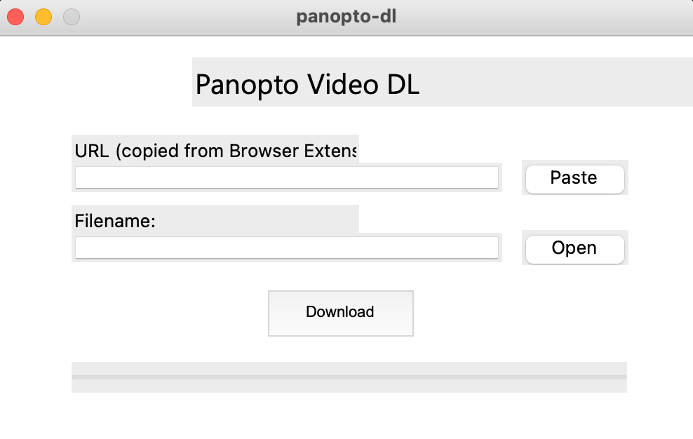
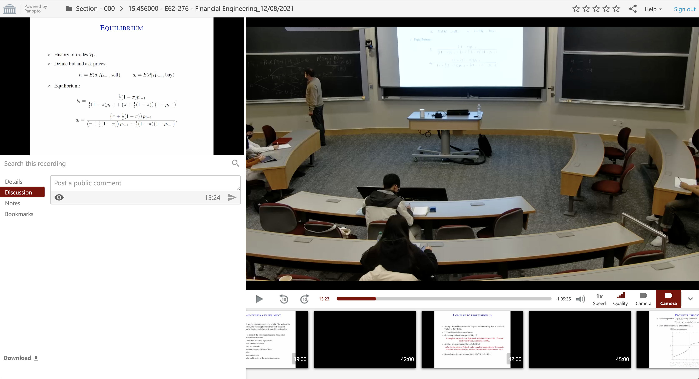

# Panopto-Video-DL
[](https://github.com/samsonq/panopto-dl/blob/master/LICENSE)
[](https://github.com/samsonq/panopto-dl)

Toolkit to download video recordings from Panopto.

### Prerequisites
- [Panopto-Video-DL-browser](https://github.com/Panopto-Video-DL/Panopto-Video-DL-browser)
- Python >= 3.7

## Module Usage
### Installation
Run the command:
```shell
pip install panopto-dl
```
### FFmpeg extension

Since version 1.4.0 _FFmpeg is no longer needed_, but it is still possible to download video
using [ffmpeg](https://ffmpeg.org/download.html) by adding `[ffmpeg]` to the pip command used to install it.  
```shell
pip install git+https://github.com/Panopto-Video-DL/Panopto-Video-DL-lib#egg=PanoptoDownloader[ffmpeg]
```

**Note**: FFmpeg **must** be added in the _system PATH_  

### Usage

- In a new terminal run the command:
```shell
panoptodownloader
```
- Paste the link automatically copied from [Panopto-Video-DL-browser](https://github.com/Panopto-Video-DL/Panopto-Video-DL-browser)
- Set the destination folder
- Wait for the download to finish

### Use as Python Module

```python
import PanoptoDownloader


URL = "https://****"
PATH = "./output.mp4"


def callback(progress: int):
    """
    :param progress: Downloading progress. From 0 to 100
    """
    print(f"{progress} / 100")


if __name__ == '__main__':
    try:
        PanoptoDownloader.download(
            URL,
            PATH,
            callback
        )
        print("Download completed")

    except Exception as e:
        print(e)
```


## Application UI
### Installation
1. Install JavaScript browser extension to get M3U8 file path
	- Install [TamperMonkey](https://www.tampermonkey.net/) Script-Manager browser extension  
		- [Chrome](https://chrome.google.com/webstore/detail/tampermonkey/dhdgffkkebhmkfjojejmpbldmpobfkfo)  
		- [Firefox](https://addons.mozilla.org/en-US/firefox/addon/tampermonkey/)  
		- [Other browser](https://www.tampermonkey.net/)  
	- Install this JavaScript script from [here](https://greasyfork.org/scripts/423661-panopto-video-dl)

2. Clone this repository to local path
	- `$ git clone https://github.com/samsonq/panopto-dl.git`
	- Install requirements to run application
		- `$ pip install -r requirements.txt`

3. Run application
	- Enter cloned repository
	- `$ cd panopto-dl`
	- `$ python main.py`
	- A UI (user-interface) should appear within a few seconds with instructions

### UI Application Usage  

1. Start application (see above section), the following UI should be displayed:


2. Open Panopto recording on web browser, and click the 'Download' button at the bottom left of the page. This will automatically copy a link for you:


3. Create a recordings folder in your local directory to store file recordings
	- `$ mkdir recordings`
	- The supported extensions of the downloaded recording include: `.mp4`, `.mkv`, `.flv`, `.avi`
4. Paste the copied link from step (2) into the application  
5. Enter the specified path to save the video recording
	- i.e. `./recordings/lecture.mp4`
6. Click the Download button and wait for recording to finish processing
	- After the progress bar reaches the end, the video recording should be saved in the specified path
